# MLCS
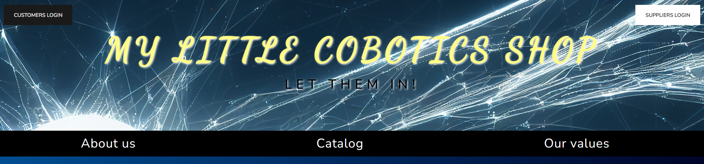
This repository contains the source code for my final project "My Little Cobotics Shop", 
a web application developed during the programming course in Python at Tokio School. 

The idea was to provide a fictional company 
and its customers with an environment to communicate 
and execute transactions in a comfortable and fast way. Three main actors are 
involved in this application: suppliers, customers and company staff. 
That is, one can create users corresponding to the mentioned
categories and recreate the business environment of the company. 

Beyond the framework that the application tries to invoke, the final purpose of 
this project has been merely educational, i.e., to enhance my Python skills while working 
with a web framework such as Flask. I would highlight two features of this 
application: 

- The **log in interfaces** which manually try to imitate those of real web applications, 
including the way in which passwords are managed: not naively storing password strings in the 
database, but as encrypted items, or an option for users to recover their forgotten passwords. 
Obviously, there is a wide variety of software tools to deal with 
passwords in web development; however, the challenge here was to create a similar system 
that could, at least to a certain extent, resemble those of common applications.
- The way in which every process that is executed in the application is also stored in the database. It is not only possible to take "pictures" of the business situation (regarding
stock, benefits, etc.), but also to keep track of the acquisitions carried out by the company, the activity
of its employees, or even get information about clients.

Disclaimer: This web application was intended to be a merely academic project for the course in Python programming of the academy Tokio School. The name of the company as well as any other name in this app either of the application, products or default users are purely fictional and do not try to represent any real person, institution or organization.

## What is there in the application when I clone it?
When the application is cloned, some accounts for users from the company are already created, 
and one can log in as any of them. Depending on the department in which the user works, 
certain actions are enabled. 

First things first, there are 4 departments in the company: 
- Management 
- Purchases
- Production
- Sales

Management users are the ones that can carry out more actions. Moreover there are
two kind of users on each department: those with high access level and 
those with low access level. 

The root user (id: 00000; pass: root) is the one with the highest access level, 
as it belongs to the management department and its access level is "high". Root 
users are the only ones allowed to create new users and delete them. Of course, 
if you want to create a new customized user with full access, you can do it 
from the root user given when cloning the repo and then, from that new user, 
delete the previous root. 

Feel free to explore the actions that each of the users can take. 
You can see their ID number and passwords in the information PDF file (don't try to look for
their password in the database file, remember: passwords are stored as encrypted tokens!). If you prefer
a guided walk, the [the last section of this document](#tutorial) is a tutorial on how to use most of the features of the application. 


## Installation guide

After cloning the repository on your machine, only two steps are required before 
running the application. 

1. Create and activate a virtual environment to install the app's dependencies.
```
py -m venv <name_of_the_environment>
.\<name_of_the_environment>\Scripts\activate
``` 
2. On the directory where you cloned the repo, execute: 
```
pip install -r requirements.txt
```

Finally, the command "py main.py" should start running the application, making 
it available on the port 5000 that you can access from your browser. 

## Tutorial: from beginning to end
<a name="tutorial"></a>

Apart from the company users, for this environment to work, we also need companies
providing the materials needed to build the robots and, on the other hand, some 
customers willing to buy them. Then, here is a tutorial to guide you through the 
whole process, from the acquisition of the robot's building components 
to its sale. 

It is useful to have 3 windows open when 
running the application. One to be used as each role: a company user, a customer, 
and a supplier.

**Now, we think of the next scenario**: a customer is willing to
buy a Talisman robot, but the company doesn't have the model in stock and has to produce it. 
To do so, you can check the different materials that are 
needed and those we have in the information PDF file. Oh,
we have everything we need except the cameras! 
(This is the situation you will find when you clone the repo)
Follow the next steps to buy a package of cameras from a 
supplier and build the robot to satisfy the client's wish.

1. As soon as you open the application in your browser, you see the welcome page. 
You can explore the different tabs to get a bit more info about the app. When you are
done, click on the button Suppliers login on the top right. You will see the login page with an option
called "Create a new user". Click on it, then choose the option "I'll be a supplier" and fill in the 
information about your company. Creativity is encouraged and not giving any real
data, especially regarding account numbers, too! Use for example AA11-1111-1111-1111-1111-1111.

<p align="center">
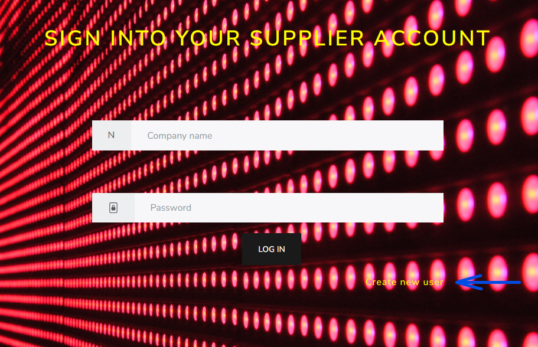
</p>

<a name="step_2"></a>
2. Once you have filled in the information, log in. You will see 4 taps with the 
different actions you can perform as a supplier. Click on "Create new service". On 
model name, choose "Camera CVision 33" (completely invented name) and fill in the 
rest of the details of your product. Watch that to create one Talisman (see PDF), only one
unit of cameras is needed. Once you click on create, a message will appear that the 
service has been successfully created, which you can see listed by clicking on the tab
"My services". 

<p align="center">
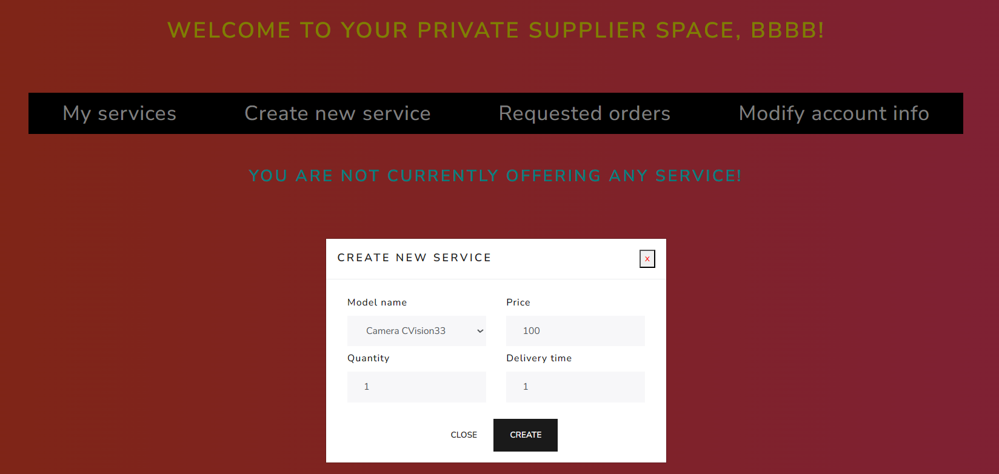
</p>

3. Oops, realize that your service still has 0 validations. That is because, for your
service to be validated by the company, it must be accepted by 3 different members. 
Then, move to the second window of your application. When you are on the welcome 
page, under "HERE'S WHAT YOU CAN DO ON THIS SITE", in the third point, see that the
words "the staff login page" are a link to the login page for staff members. Click on 
it. Watch that on a real website, this login page would never be so easily accessible
for people outside the company. So, to keep it simple, I just hid the access a bit ;).

<p align="center">
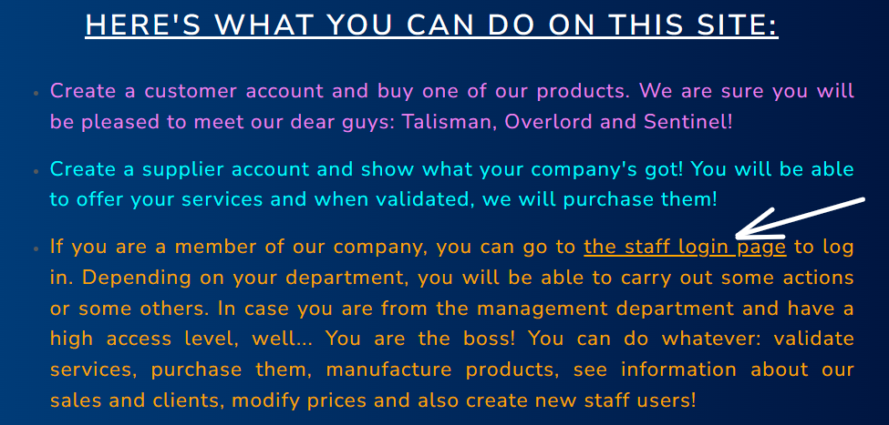
</p>

4. Now log in as the root (ID: 00000; pass: root). Realize that you will need 3 different
users to validate the service of your invented company. However, you only have the 
root and Harper Bennet as users able to validate products. Therefore, the first step
will be to create a new user. Click on the tab "Create new user" and fill in the 
information. The only thing to pay attention to here is that only management with high 
access and purchases with high access are allowed to validate products, so make sure
that you allocate the new user to one of these categories.

<p align="center">
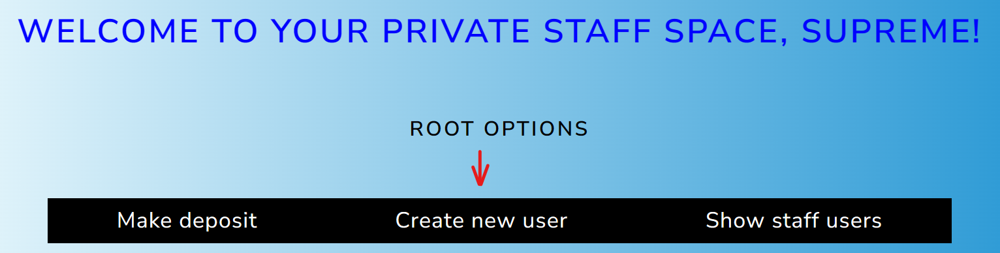
</p>

5. When you click on "Sign in", you directly log in as the new user. Now it's time 
to validate the product. In the "PURCHASES OPTIONS" menu if you logged in as a root or in,
the usual tab if you logged in as a purchases user, you will find the tab 
"Show services". There you can see all the services that have been offered by the 
different companies, including the one you generated in [step 2](#step_2). To validate the 
service as your newly created user, you have to click on the number in the "validations"
column of the table. You will see the success message, and if you click again on the
"Show services" tab, you will see that the number increased by one. Don't try to 
validate it again! Remember that validations must be given by 3 DIFFERENT users.

<p align="center">
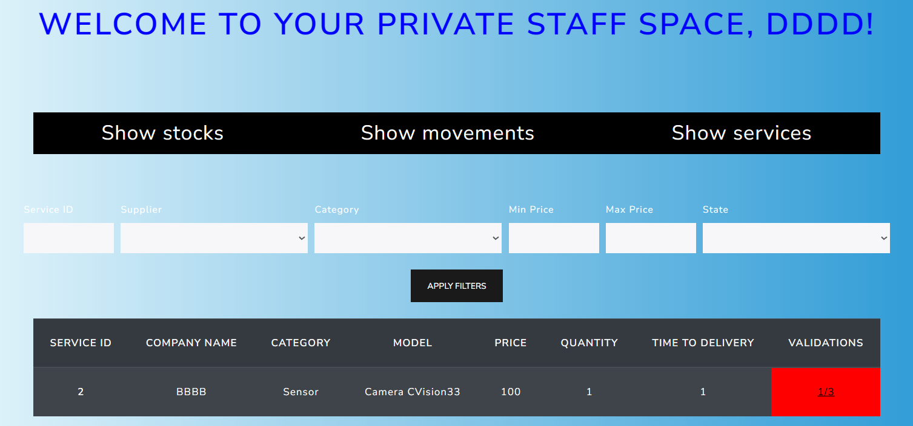
</p>

6. Then what you have to do is to log in again as the other 2 users which are able to validate
services (root and Harper Bennet) and repeat the process (for the moment,
the easiest way is reach the welcome page is to enter the raw url http://127.0.0.1:5000/ in your navigator; 
a suitable button to log out will be added in the future). This might be the most annoying
step, but remember that these 3 users could be real people who should agree that
that offer is worth it for the company. When you validate the service for the third
time, it becomes green! 
7. See that the number under "Service ID" in the services table now has become a button. 
Click on it to purchase the service. Before that, you can click on the tab "Show 
stocks" to confirm that until that moment, the number of cameras that the company has
is zero. Percentages show how many items of each class the real company should have to be
able to operate without shortage risks... See that a lot of products are needed, 
after this tutorial you could try to fix it!. 
Come back to the service table and buy the service. Oops, there is not enough
money! Right, because you start with 0 dollars in your account. To solve this, go to
"ROOT OPTIONS" and click on "Make deposit" to add the quantity you want to your 
account (you can only make deposits as a root). As much as you want! At least enough to buy the service...

<p align="center">
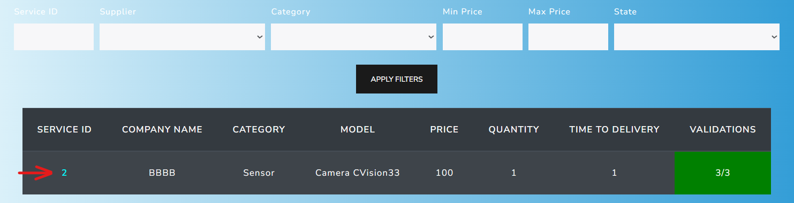
</p>

8. Again, try to buy the service, now it should work. After the success message, 
you will see that the service is gone. You can come back to "Show stock" and confirm that it has 
been increased by the number of units that you specified when creating your service in 
[step 2](#step_2). 

<p align="center">
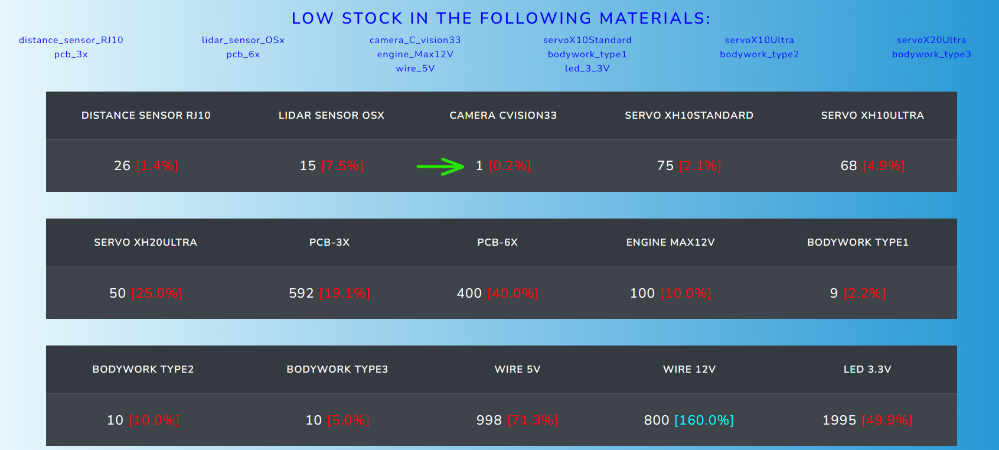
</p>

9. So now the company is ready to manufacture a Talisman. You can do it from the
"PRODUCTION OPTIONS" of the root user or the user Ava Thompson, who is in the 
production department. In any case, click on "Manufacture product". 
Select the model Talisman T and 1 unit. You will see the success message, and if 
you click on "Show storehouse", you can confirm that now the company has one
Talisman robot to sell. 

<p align="center">
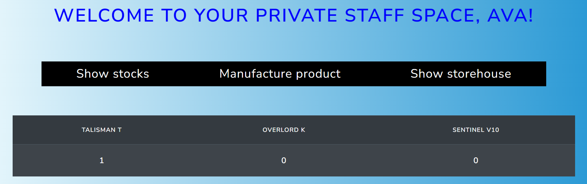
</p>

10. Finally, let's move to the "SALES OPTIONS". Before your client buys the product,
you can adjust the different prices in the tab "Modify prices". Again, this can 
be done from the root or from the user Ethan Reynolds, who is in the Sales 
department. 

<p align="center">
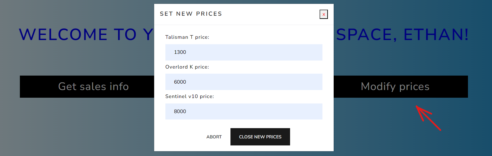
</p>

11. We are almost there! Now open a third window for the application. On the 
welcome page, click on the "Customers login" option in the top left corner. 
Choose the option "create new user", then "I'll be a customer", and fill in your 
information. Pay attention to the required format of the card number (always invented! 
Remember the points about creativity and no personal data). Once you have
created your account, you can log in. 
12. Let's avoid the previous error, and now let's add money to our account from the
beginning. Choose the tab "Make deposit" and a quantity to expend. You can consult
the price of the Talisman robot in the catalog. In the "See my wallet" option, you 
can check how much money your client has. 

<p align="center">
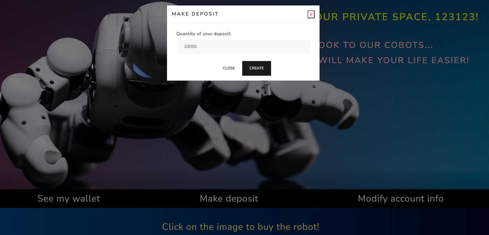
</p>

13. If you click in the picture of the Talisman robot, a message will appear asking 
if you would like to confirm the purchase. If you accept, you will see the message: 
"THAT TALISMAN IS YOURS! ENJOY!". And that's all! You have completed the process 
from cover to cover!

<p align="center">
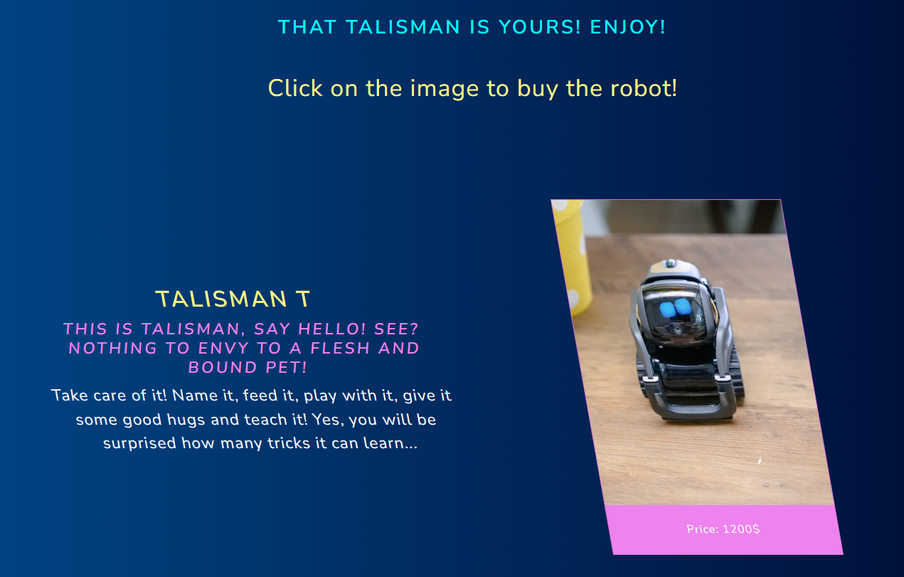
</p>

But wait, a lot of things have occured here during these 13 steps... The loggins, 
the movements on the bank accounts, the changes of the quanties of each thing, 
how can you keep track of all of this? Super easy, because every little step has
been recorded! You can go back to the different accounts. See that there are some
other tabs and mere informative menus that we have not covered on this tutorial. Feel 
free to watch all of them and check that everything has been stored in the database.
You could even check the database file itself and see all the information that you 
have generated during this tutorial. I hope you enjoyed it!

## References

All pictures used in the application have been taken from Pexels: https://www.pexels.com/

